# 📱 Dự án thương mại điện tử 
Dự án là một hệ thống thương mại điện tử (E-commerce) được xây dựng bằng ReactJS và Node.js, nhằm mô phỏng quy trình mua bán sản phẩm trực tuyến.

Dự án tập trung vào việc phát triển giao diện người dùng hiện đại, quản lý trạng thái, xử lý dữ liệu và xây dựng API backend. Người dùng có thể duyệt sản phẩm, tìm kiếm, thêm vào giỏ hàng và thực hiện các thao tác mua sắm cơ bản.

Ngoài ra, dự án còn giúp rèn luyện kỹ năng làm việc với RESTful API 

**URL** : https://smartphone-gray.vercel.app/

**Admin**

    **Tên đăng nhập: Hung
    **Mật khẩu: 123

---

### Frontend
- **ReactJS** – Thư viện xây dựng giao diện người dùng
- **Redux Toolkit** – Quản lý trạng thái ứng dụng
- **React Hooks** – Xử lý state và lifecycle
- **Axios & Fetch API** – Gửi request và làm việc với API
- **Tailwind CSS & SCSS** – Thiết kế giao diện và styling
- **Component-based Architecture** – Tách nhỏ UI thành các component (Product List, Detail, Ads,...)

### Backend
- **Node.js** – Xây dựng server và xử lý logic backend
- **Firebase** – Hỗ trợ lưu trữ dữ liệu  

---

Chức năng chính 

1.   Hiển thị banner quảng cáo (Component: ProductAds)
2.   Danh sách sản phẩm điện thoại (Component: PhoneList)
3.   Xem chi tiết sản phẩm (Component: PhoneDisplay)
4.   Ẩn/hiện thông tin chi tiết
5.   Tìm hiểu cấu trúc component hóa
6.   Giỏ hàng, thêm và xóa sản phẩm,
7.   Admin
8.   Đăng nhập người dùng
9.   Bộ lọc, tìm kiếm sản phẩm,
10.  quản lý đơn hàng,
11.  map Api,
12.  Chatbot,
13.  Theme(Sáng/Tối) 

Ảnh demo

.png)
.png)
.png)
.png)
.png)
.png)
.png)
.png)
.png)
.png)
.png)
.png)
.png)
.png)
.png)
.png)
.png)
.png)
.png)
.png)
.png)
.png)
.png)
.png)
.png)
.png)

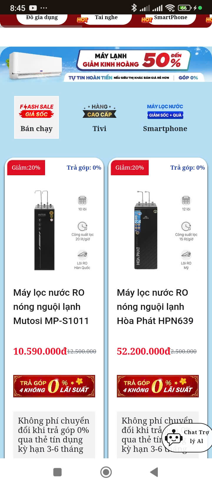
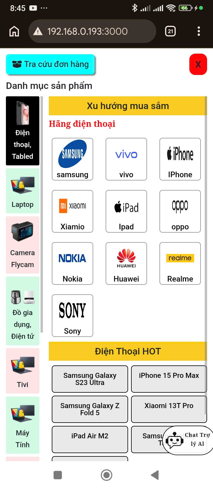
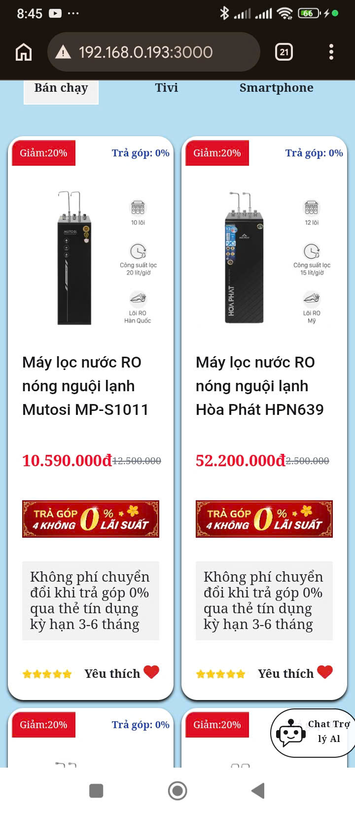
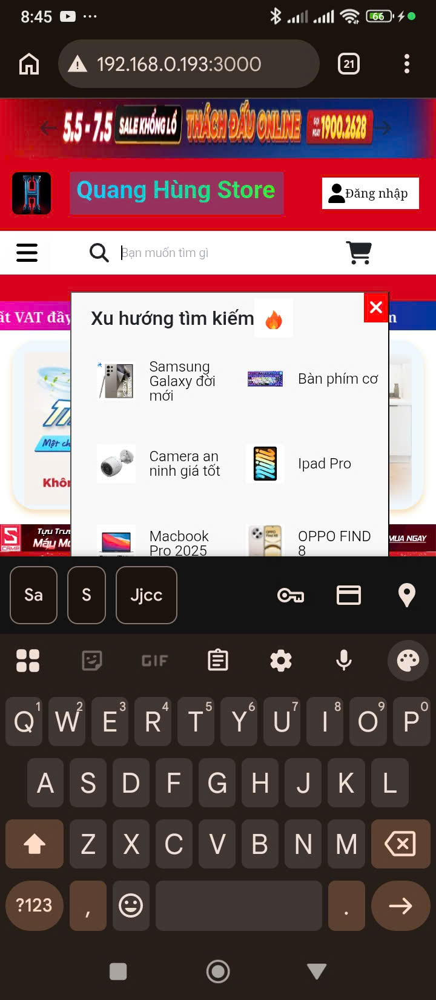
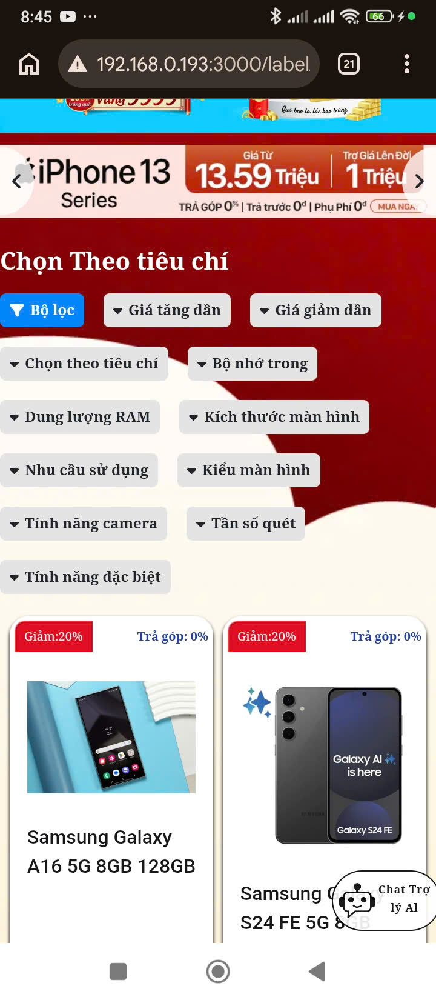
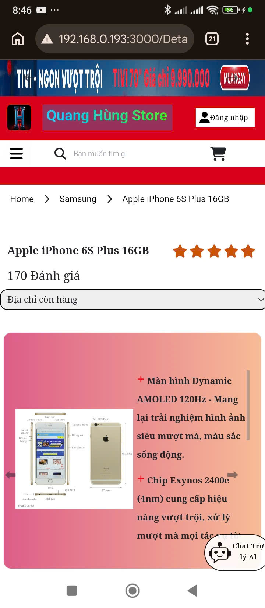
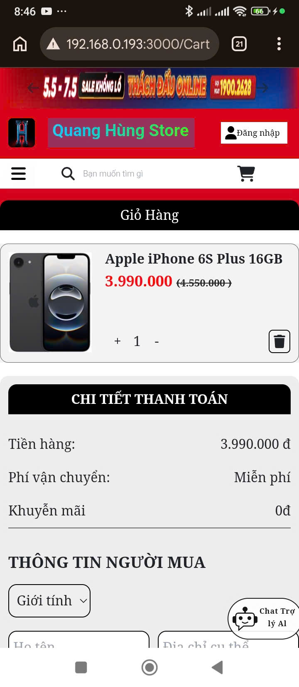
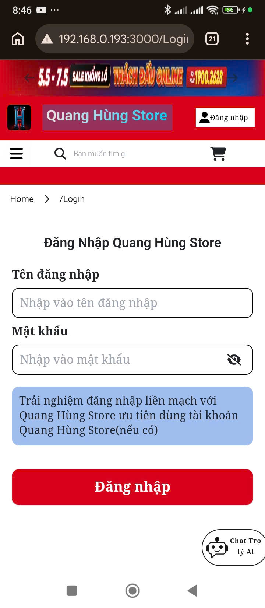
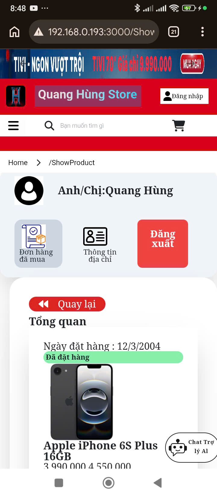
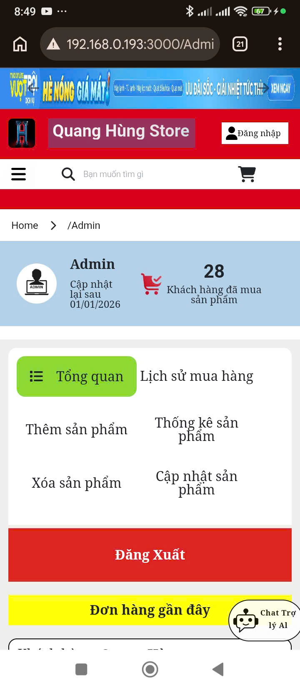
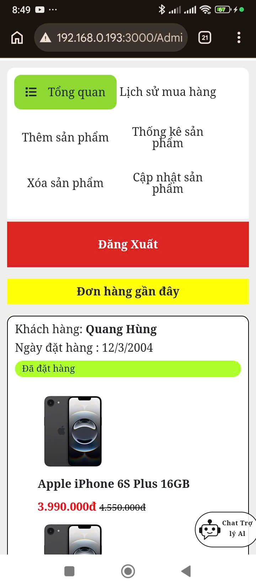
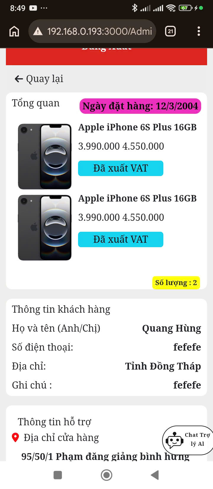
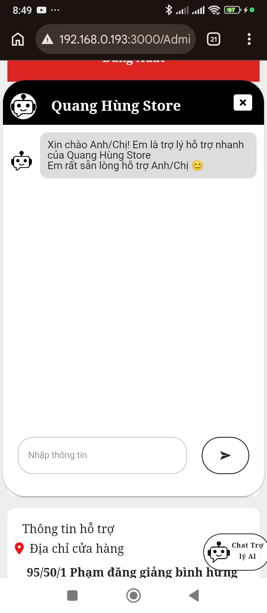
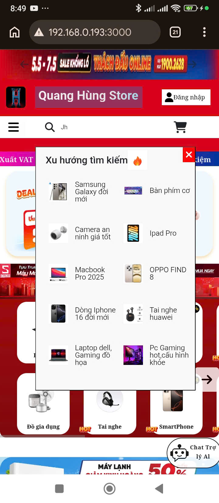
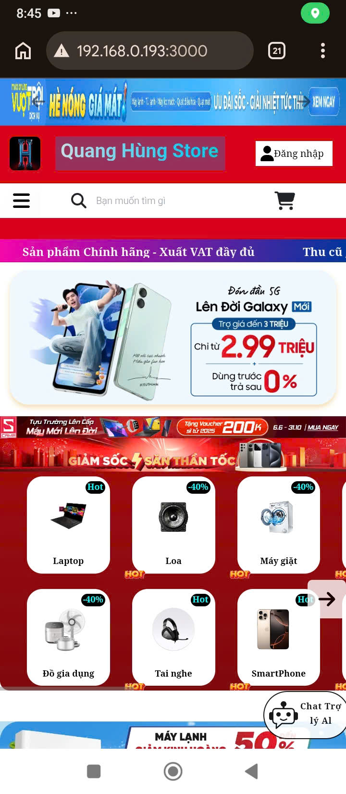